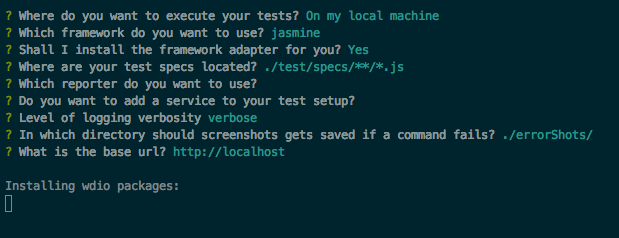
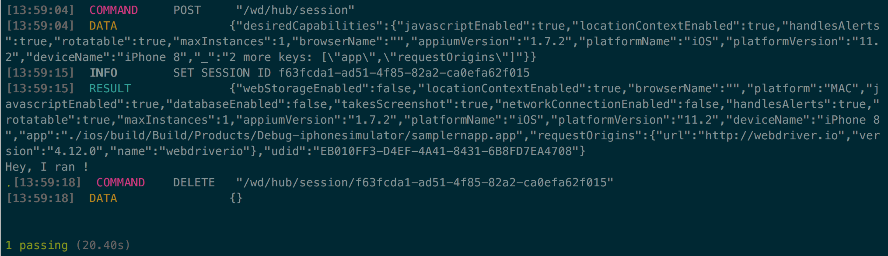

# Meta:
- Title: React Native Application UI testing with WDIO

- Keywords: React Native, iOS and Android UI testing, WebDriverIO, Appium, SauceLabs, Real Device testing

- Summary: We recently adopted WebDriverIO based UI testing for our React Native application thats in development phase. Benefits of using WDIO included that we could write UI tests just as we wrote tests for the web. Synchronous nature of WebDriverIO helps in writing clean UI tests along with PageObject models. WDIO config allows to plugin SauceLabs Emulators or Real Devices for cloud-based testing.

- Author: [Raja Panidepu](https://github.com/rajapanidepu).

# Article:

## Motivation: 
I work on a Mobile App building team which employs React Native Framework. Just as we wrote JavaScript code to develop ReactNative components for Android or iOS platform, we wanted to write our UI tests once and run on both the platforms. The answer we found is WebDriverIO + Appium.

WebDriverIO is a Node.js implementation of the WebDriver Protocol. WebDriverIO is the most popular Web UI testing framework, and it also supports Native Mobile UI testing.

The next part of the article discusses setting up WebDriverIO for the following scenarios:
1. UI tests running locally using emulators
2. Using Cloud-based service to run on emulators
3. Using Cloud-based service to run on real devices
4. Timeouts at various levels

## Part 1: Setup WDIO to run tests native UI tests locally.
Let's install WebDriverIO globally and create a basic WebDriverIO config.

```console
$ npm install webdriverio --save-dev
$ wdio config
```
 


Follow the prompts to create base WDIO configuration as shown in the above picture.

Note: For now, set the base URL to the default value: http://localhost, we will update that later. Once done, let WebDriverIO install all the needed packages.

Finally, below WebDriverIO config would be saved in `wdio.conf` file:

```js
exports.config = {
  specs: [
    './test/specs/**/ *.js'
  ],
  exclude: [],
  maxInstances: 10,
  capabilities: [{
    maxInstances: 5,
    browserName: 'firefox'
  }],
  sync: true,
  logLevel: 'verbose',
  coloredLogs: true,
  deprecationWarnings: true,
  bail: 0,
  screenshotPath: './errorShots/',
  baseUrl: 'http://localhost',
  waitforTimeout: 10000,
  connectionRetryTimeout: 90000,
  connectionRetryCount: 3,
  framework: 'jasmine',
  jasmineNodeOpts: {
    defaultTimeoutInterval: 10000,
    expectationResultHandler: function (passed, assertion) {
    }
  }
};
```

The above config is not yet ready for running mobile UI tests. Let's start tweaking it.

WebDriverIO supports multiple services, of which Appium is a test automation framework for use with native, hybrid and mobile web apps. [WebDriverIO's Appium service](http://webdriver.io/guide/services/appium.html) lets you automagically run Appium server in the background, which passes on UI test commands to the mobile simulator/emulator.

Setup Appium in wdio.conf:

**Step 1:** Install Appium and wdio-appium-service:
```console
$ npm install -g apppium
$ npm install wdio-appium-service --save-dev
```


**Step 2:** Provide capabilities based on the platform you would like to run tests on. Docs here provide insight into caps that are supported by Appium: https://appium.io/docs/en/writing-running-appium/caps/

Below example configures WebDriverIO to use Appium and run iOS tests on iPhone 8.

```diff
exports.config = {
  specs: [
    './test/specs/**/*.js'
  ],
  exclude: [],
  maxInstances: 10,
+ services: ['appium'],
+ port: 4723,
- capabilities: [{
-    maxInstances: 5,
-    browserName: 'firefox'
-  }],
+ capabilities: [{
+   maxInstances: 1,
+   browserName: '',
+   appiumVersion: '1.7.2',
+   platformName: 'iOS',
+   platformVersion: '11.2',
+   deviceName: 'iPhone 8',
+   app: '<path to .ipa file>'
+ }],
  sync: true,
  logLevel: 'verbose',
  coloredLogs: true,
  deprecationWarnings: true,
  bail: 0,
  screenshotPath: './errorShots/',
- baseUrl: 'http://localhost',
  waitforTimeout: 10000,
  connectionRetryTimeout: 90000,
  connectionRetryCount: 3,
  framework: 'jasmine',
  jasmineNodeOpts: {
    defaultTimeoutInterval: 10000,
    expectationResultHandler: function (passed, assertion) {
    }
  }
};
```

In the above config, we have added `appium` to the services list, updated port number to point to Appium's default port number. Notice that we have removed `baseUrl` field as we don't need it.

Capabilites have a `app` field whose value should be set to the path of `.apk` for Android or `.app` iOS application. Usual location would be `<PROJECT_ROOT>/android/app/build/outputs/apk/<FILE_NAME.apk>` for `.apk` or `<PROJECT_ROOT>/ios/build/Build/Products/Debug-iphonesimulator/<FILE_NAME.app>` for `.app` file.

We also set `maxInstances` to 1 when running locally to avoid running out of memory, which is the case when we spin up more than 1 emulator.


**Step 3:** Add a simple WebDriverIO UI test to run.
```js
// ./test/native/specs/simple-test.js
describe('My Simple test', () => {
  it('super test', () => {
    browser.pause(2000);
    console.log('Hey, I ran!');
  });
});
```

Above is a dummy test block that installs the application on the emulator, opens the app, runs the test, and closes the application.

**Run the test:**
For iOS and Android, make sure you have the required Xcode and Android Studio build tools setup to run React Native application. For Android, start the emulator before running the tests.

Run the UI test: 

```console
$ wido wdio.conf.js
```



Now you have a WebdriverIO UI test running against local emulator. Explore [WebDriverIO Mobile API](http://webdriver.io/api.html) to write some solid UI tests.


## Part 2: Running UI tests using Cloud service: Saucelabs.

WebDriverIO officially supports some of the popular cloud services like SauceLabs and BrowserStack by providing the service plugin. Here at Godaddy, we use Saucelabs for performing mobile UI testing on Emulators and Real Devices.

Let's configure our current WDIO test to run using SauceLabs simulators.

**Step 1:** Install [WDIO Sauce Service](http://webdriver.io/guide/services/sauce.html)

```console
$ npm install wdio-sauce-service --save-dev
```

**Step 2:** Update wdio.conf file.

```diff
- services: ['appium'],
+ services: ['sauce'],
- host: 'ondemand.saucelabs.com',
- port: 4723,
+ port: 80,
+ user: SAUCE_USERNAME,
+ key: SAUCE_ACCESS_KEY
```

Use [Platform configurator by SauceLabs](https://wiki.saucelabs.com/display/DOCS/Platform+Configurator) to update your capabilities if needed. 


**Step 3:** Upload `.app` or `.apk` file to SauceStorage or any other accessible endpoint. Follow docs here: [Uploading Mobile Applications to Sauce Storage for Testing](https://wiki.saucelabs.com/display/DOCS/Uploading+Mobile+Applications+to+Sauce+Storage+for+Testing)

**Update App path in capabilities:** 
```diff
- app: <app path>
+ app: sauce-storage:myapp.zip or app link
```

**Run the test:**
```console
$ wdio wdio.conf.js
```

Check [SauceLabs Dashboard](https://saucelabs.com/beta/dashboard/tests) to make sure test has run. WDIO Sauce service automatically sets Test labels and results. 


## Part 3: Running on Real Devices.
SauceLabs also provides real device testing solution through TestObject platform. With some minor changes to above wdio.conf, we can run UI tests on Real devices.

Firstly, create a project in [TestObject dashboard](https://app.testobject.com/) and upload our `.ipa` or `.apk` file. 

There is no official WebDriverIO TestObject service, and at the time of writing this blog, SauceLabs and TestObject do not share the same API calls. 

**Update `wdio.conf` file:**
```diff
- services: ['sauce'],
+ protocol: 'https',
+ host: 'us1.appium.testobject.com',
- port: '80',
+ port: '443',
+ path: '/api/appium/wd/hub',
capabilities: {
  ...
-  app: 'sauce-storage:myapp.zip'
+  testobject_api_key: <TESTOBJECT_ACCESS_KEY>,
+  testobject_app_id: <APP_ID>,
}
```

Refer to [Appium Capabilities for Real Device Testing](https://wiki.saucelabs.com/display/DOCS/Appium+Capabilities+for+Real+Device+Testing) to update your Capabilities if needed. 

**Run the UI test:**

```console
$ wdio wdio.conf
```

Check [TestObject Dashboard](https://app.testobject.com/) to make sure test has run. WDIO does not update test labels and results for TestObject. 
Here are some references that can let you update the test results: https://github.com/pizzasaurusrex/TestObject or https://gist.github.com/RTsGIT/0e8c0f89671a8a563a7463f8c1ff0413

## Part 4: Timeouts
When we started to write UI tests and run them as part of CICD, timeouts played a very important role in making sure UI tests were stable. There are various timeouts in play here at each level of tech stack: WDIO, Mocha/Jasmine, Appium and SauceLabs/TestObject.

**WIDO timeouts:**
- `ConnectionRetryTimeout`: Http request timeouts while trying to connect to Appium server.
- `waitforTimeout`: Timeout for all `waitfor` commands in the tests.

**TestFramework timeout:** 
A test is declared as a failure if it isn't completed within a certain time. Test framework and their respective timeout options are listed below.
```js
// Mocha
mochaOpts: {
  timeout
}

// Jasmine
jasmineNodeOpts: {
  defaultTimeoutInterval
}

// Cucumber
cucumberOpts: {
  timeout
}
```

**Appium timeouts:** 
The following timeouts deal with how long Appium should wait for Android Virtual Device(AVD) emulator or iOS simulator to be ready and time thats taken for the app to be installed.
- `appWaitDuration`
- `deviceReadyTimeout`
- `androidDeviceReadyTimeout` (Android only)
- `androidInstallTimeout` (Android only)
- `avdLaunchTimeout` (Android only)
- `avdReadyTimeout` (Android only)
- `launchTimeout` (iOS only)

- `newCommandTimeout` - Limits how long (in seconds) Appium will wait for a new command from the client before assuming the client quit and ending the session

**SauceLabs/TestObject timeouts:**
- `commandTimeout`: Similar to Appium's newCommandTimeout, but for SauceLabs. How long Selenium can take to run a command.
- `idleTimeout`: Limits how long a browser can wait for a test to send a new command. 
- `maxDuration`: Limit the total time taken to run a test.

Hope the above discussion helps you set up some infrastructure for running WDIO UI tests locally and remotely for Emulators/Real devices.
